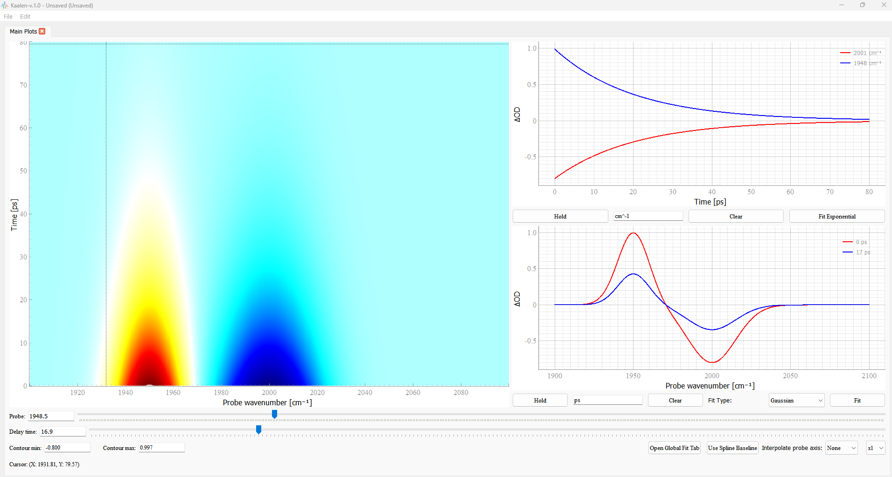

# Kaalen-v2.0

Kaalen is a intuitive desktop application for visualizing and analyzing **Time-resolved spectroscopic data**. Built with **PyQt5, matplotlib, pyqtgraph**, and **lmfit**, this program provides a comprehensive suite of tools for tasks such as interactive data plotting, baseline correction, **PFID fitting** and **global fitting**. The application evolved from a simple Matplotlib-based program I used extensively during my Ph.D. The need for a more robust and user-friendly tool for analyzing spectroscopic data inspired to build this comprehensive application using PyQt, making it more intuitive and accessible for everyone. 

   

 

---

## ✨ Key Features

### 🖼️ Interactive Data Visualization

* **2D map**: Display your time-resolved data as a dynamic 2D map.
* **1D Slices**: Interactively slice the 2D data along either the time (**kinetic trace**) or probe (**spectrum**) axis.
* **Live Updates**: Use sliders and input fields to precisely control the slices, with plots updating in real-time.
* **Multiple Overlays**: Hold and overlay multiple slices on a single plot for easy comparison.
* **Customizable Plots**: Adjust line thickness and axis labels to create publication-quality figures.

### 📈 Advanced Fitting & Analysis

* **Global Fitting**: Perform multi-exponential global analysis on your entire 2D dataset.
* **Automated Guesses**: Use **Singular Value Decomposition (SVD)** to automatically generate initial guesses for decay constants ($τ$).
* **Convoluted Model**: Incorporate instrument response into the fit using an analytical Gaussian-convoluted exponential model, with adjustable $t_0$ (time zero) and FWHM (Full Width at Half Maximum).
* **Fit Reporting**: View a detailed **lmfit** report with best-fit parameters, uncertainties, and R-squared value.
* **DAS Spectra**: Automatically generate and plot **Decay Associated Spectra (DAS)** from the global fit results.
* **Interactive Local Fitting**: Fit individual 1D slices with a variety of functions.
* **Exponential Decay**: Fit kinetic traces with a multi-exponential model. Draw on top of the data (click and drag).
* **Spectroscopic Peaks**: Fit spectral slices with multi-Gaussian or multi-Lorentzian functions. Draw on top of the data (click and drag)
* **Interactive Guessing**: Visually draw initial guesses for your fits directly on the plot by clicking and dragging.

---

### 📁 Project Management

* **Load & Save Projects**: Save your entire workspace, including the loaded data, current plot states, held slices, and fitting parameters, into a single project file (**`.specdatpp`**).
* **Data Export**: Export fit results, DAS spectra, and fitted 2D data to CSV files for use in other applications.

---

### Installation

In the top of this page, you will find 'Actions'. Click on it and click on the most recent action. This will have an artifact which is the most recent for the windows in it. 

---
### ✏️ Author's Note

This python project was developed duing my PhD work in AG Horch, FU Berlin, funded by the DFG UniSysCat grant (EXC 2008 – 390540038). It began as a custom Matplotlib-based interactive plotting tool and was later transformed into a PyQt-based application with the assistance of AI tools. It was a personal application to simplify my own data analysis, and now it is available for other users.

---

### 🤝 Contributing

Contributions are welcome! If you find a bug or have an idea for a new feature, please open an issue or submit a pull request.

---

### Citation

Please check the Zenodo link https://zenodo.org/records/17038308 for the citation. DOI: https://doi.org/10.5281/zenodo.17038308
